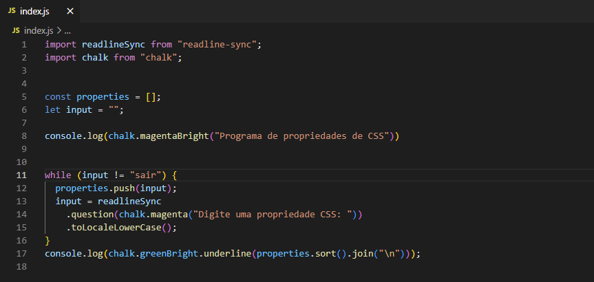
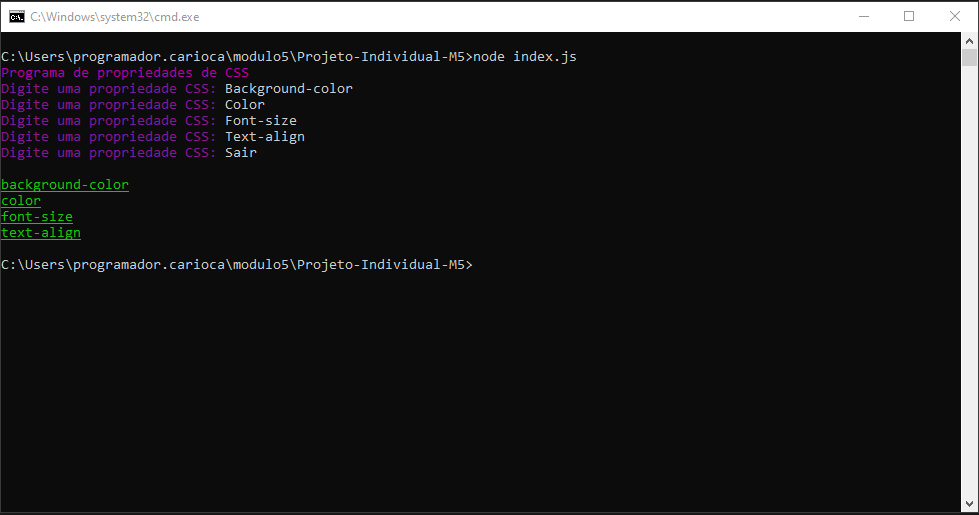

[](https://git.io/typing-svg)


-------------------------------------------------------------------------------------------------------------------------------------------------------------------------

### CONTEXTO:
<p> ➔ Usar o Node para montar um código que vai receber uma lista de
propriedades de CSS (ex: background-color, font-size, text-align) e vai devolver
essa lista ordenada de A-Z. Ordenar o CSS ajuda a encontrar mais rápido a
propriedade que precisamos alterar.</p>

<p>➔ O código deve rodar em um laço que vai receber propriedades até a
pessoa digitar a palavra “SAIR”, quando isso acontecer vai ser impresso
no terminal a lista das propriedades ordenadas de A-Z uma em cada linha </p>

### Demostração Do Projeto:


Através do Node.js é realizado a contrução do código que recebe uma lista de propriedades de CSS (ex: background-color, color, font-size, text-align) e devolve essa lista ordenada de A-Z.

--------------------------------------------------------------------------------------------------------------------------------------------------------------------

 ### Clone o Repositório 
 
 ```bash
$ git clone https://github.com/EloisePR/Projeto-Individual-M5
 ```
 
 ### Utilize os códigos abaixo em seu terminal para verificar o funcionamento do projeto 
 <p>npm init</p>
 <p>npm i chalk</p>
 <p>npm i readline-sync</p>
 <p>node index.js</p>


--------------------------------------------------------------------------------------------------------------------------------------------------------------------
<h2> <b>Libs usadas</b>:  </h2> .

<h3>Chalk:  </h3>
<hr>
<br>


<h3>Readline-sync:  </h3>
<hr>
 
